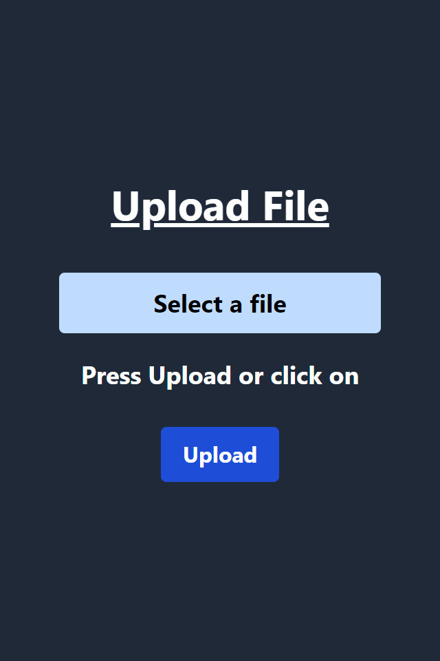

# React File Uploader

React File Uploader is a project that allows you to upload files using React and Vite.

## Features

- Upload files with ease
- User-friendly interface
- Real-time feedback and progress updates
- Responsive design
- Optimized for performance
- Built with React and Vite
- Uses Tailwind CSS

## Preview

## Technologies Used

- React
- Vite
- TypeScript
- Tailwind CSS

## Getting Started

To get started with the React File Uploader project, follow these steps:

1. Clone the repository
2. Navigate to the project directory: `cd react-file-uploader`
3. Install the dependencies: `npm install`

### Development Mode

To run the app in development mode, use the following command:

This project was bootstrapped with [Vite](https://vitejs.dev/guide/#getting-started).

## Available Scripts

In the project directory, you can run: `npm run dev`

Runs the app in the development mode.\
Open [http://localhost:5173](http://localhost:5173) to view it in your browser.

The page will reload when you make changes.\
You may also see any lint errors in the console.

`npm run build` builds the app for production to the `dist` folder.\
It correctly bundles React in production mode and optimizes the build for the best performance.

The build is minified and the filenames include the hashes.\
Your app is ready to be deployed!

See the section about [deployment](https://facebook.github.io/create-react-app/docs/deployment) for more information.

`npm run preview` runs the app in the preview mode.

## Install Tailwind CSS with Vite

If you want to customize the styles or design of the file uploader, you can use Tailwind CSS. Follow the [Tailwind CSS installation guide](https://tailwindcss.com/docs/guides/vite#react) to set up Tailwind CSS with Vite.

## Contributing

Contributions are welcome! If you'd like to contribute to the react-file-uploader project, please follow these guidelines:

1. Fork the repository.
2. Create a new branch for your feature or bug fix.
3. Make the necessary changes and commit them.
4. Push your branch to your forked repository.
5. Submit a pull request to the `main` branch of the original repository.

Please ensure that your code follows the project's coding style and conventions.

## License

This project is licensed under the [MIT License](LICENSE).
